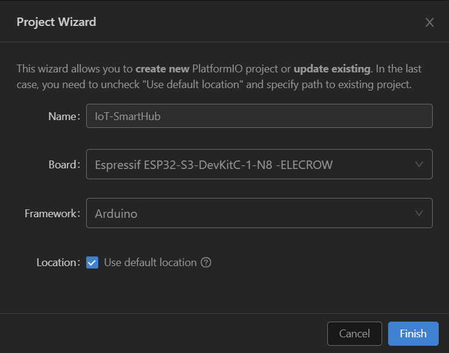

# IoT-SmartHub

This repository currently contains the pieces needed to set up a PlatformIO project for the Elecrow 7.0-inch CrowPanel ESP32-S3:

- `esp32-s3-devkitc-1-myboard.json`: the custom PlatformIO board definition already configured for the Elecrow board.
- `platformio_setup.png`: a screenshot showing the expected PlatformIO project wizard settings.

## PlatformIO Setup

1. Install Visual Studio Code and the PlatformIO IDE extension.
2. Copy `esp32-s3-devkitc-1-myboard.json` into PlatformIO's ESP32 boards folder.
   - Windows default location: `C:\Users\<your-user>\.platformio\platforms\espressif32\boards\`
   - If the `espressif32` folder does not exist yet, create any ESP32 PlatformIO project first so PlatformIO downloads that platform.
3. Restart VS Code after copying the board file.
4. In VS Code, open PlatformIO and create a new project.
   - Project name: `IoT-SmartHub`
   - Board: `Espressif ESP32-S3-DevKitC-1-N8 -ELECROW`
   - Framework: `Arduino`
   - If you want the PlatformIO project to live in this folder, uncheck `Use default location` and point the project location here.



5. Make sure your `platformio.ini` uses the custom board ID from the JSON filename:

```ini
[env:esp32-s3-devkitc-1-myboard]
platform = espressif32
board = esp32-s3-devkitc-1-myboard
framework = arduino
build_flags =
  -D LV_LVGL_H_INCLUDE_SIMPLE
  -I./include
```

## Notes

- The board ID is `esp32-s3-devkitc-1-myboard`, which comes from the filename `esp32-s3-devkitc-1-myboard.json`.
- The included board file already carries the Elecrow board name, PSRAM-related flags, `huge_app.csv` partitions, and the upload speed expected by the panel setup.
- If the custom board does not appear in PlatformIO after copying the file, restart VS Code again and confirm the JSON is in the `boards` folder above.

## Reference

For the full Elecrow walkthrough and firmware-side details, use the official guide:

[CrowPanel ESP32 7.0-inch with PlatformIO](https://www.elecrow.com/wiki/CrowPanel_ESP32_7.0-inch_with_PlatformIO.html?srsltid=AfmBOopfj4uwlqOoM2UTBgFlwcAVjQDZ49enjFf_5-aE7s6TExp0BJxs)
