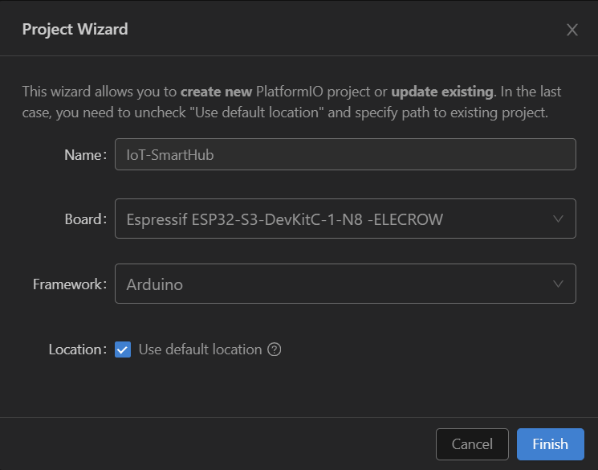

# IoT-SmartHub

## PlatformIO Setup

This repo is one PlatformIO project with separate firmware folders:

- `Screen Code/Screen-pIO` - current CrowPanel screen firmware.
- `Camera Code/Camera-pIO` - Seeed Studio XIAO ESP32S3 Sense camera firmware.

Open `C:\IoT-SmartHub\Iot-SmartHub` in VS Code. The root `platformio.ini`
exposes two upload environments:

- `screen` uploads the CrowPanel screen firmware.
- `camera` uploads the XIAO ESP32S3 Sense camera firmware.

Do not open the nested screen or camera folders as separate PlatformIO projects.
They are only source folders now.

1. Install Visual Studio Code and the PlatformIO IDE extension.
2. Copy `esp32-s3-devkitc-1-myboard.json` into PlatformIO's ESP32 boards folder.
   - Windows default location: `C:\Users\<your-user>\.platformio\platforms\espressif32\boards\`
   - If the `espressif32` folder does not exist yet, create any ESP32 PlatformIO project first so PlatformIO downloads that platform.
3. Restart VS Code after copying the board file.
4. Open `C:\IoT-SmartHub\Iot-SmartHub` in VS Code.
5. In PlatformIO, use Project Tasks to upload either environment:
   - `screen > General > Upload`
   - `camera > General > Upload`



The screen environment uses the custom board ID from the JSON filename:

```ini
[env:screen]
platform = espressif32
board = esp32-s3-devkitc-1-myboard
framework = arduino
```

Create your local app settings file before building the screen firmware.
   - Copy `Screen Code/Screen-pIO/include/AppConfig.example.h` to `Screen Code/Screen-pIO/include/AppConfig.h`
   - Fill in your own Wi-Fi name, password, OpenWeather API key, location, units, and Spotify values
   - `AppConfig.h` is gitignored, so your private values stay off GitHub

## Camera Firmware Setup

The camera firmware targets the Seeed Studio XIAO ESP32S3 Sense with PlatformIO's
`seeed_xiao_esp32s3` board ID. It uses the Sense camera expansion board pin map
for the OV2640 module.

1. Copy `Camera Code/Camera-pIO/include/CameraConfig.example.h` to `Camera Code/Camera-pIO/include/CameraConfig.h`.
2. Fill in your Wi-Fi SSID and password.
3. Open the repo root, `C:\IoT-SmartHub\Iot-SmartHub`, in PlatformIO.
4. Build/upload the `camera` environment.

Command-line upload:

```powershell
pio run -e camera -t upload
```

After upload, open the serial monitor at `115200`. The firmware prints the local
camera URL when Wi-Fi connects. Use `/capture` for a still JPEG or `/stream` for
MJPEG streaming.

## Spotify Setup

The music screen uses Spotify's Web API to read the currently playing track,
show album art, and send play/pause/next/previous commands to your active
Spotify device. It does not stream Spotify audio on the ESP32.

In `Screen Code/Screen-pIO/include/AppConfig.h`, set:

```cpp
constexpr char SPOTIFY_CLIENT_ID[] = "your client id";
constexpr char SPOTIFY_CLIENT_SECRET[] = "your client secret";
constexpr char SPOTIFY_REFRESH_TOKEN[] = "your refresh token";
constexpr char SPOTIFY_MARKET[] = "US";
constexpr char SPOTIFY_DEVICE_ID[] = "";
```

Generate the refresh token with these scopes:

```text
user-read-currently-playing user-read-playback-state user-modify-playback-state
```

Leave `SPOTIFY_DEVICE_ID` empty to control the currently active Spotify
Connect device. Spotify playback-control endpoints require a Spotify Premium
account and an active player.

## Smooth UI via RTOS Tasks

The screen firmware leans heavily on FreeRTOS to keep LVGL fluid while the
ESP32 is doing slow work in the background. Every blocking network call —
OpenWeather, Spotify, football-data.org, BLE flag PNG downloads — is offloaded
to a one-shot worker task pinned to **core 0**. The Arduino `loop()` (and with
it `lv_timer_handler`) owns **core 1** exclusively, so animations, swipe
gestures, and the blinking clock colon keep rendering even during a multi-
second TLS handshake or a 15 s Wi-Fi reconnect.

The pattern is the same for each feature:

1. A `start*PollTask()` function spawns an `xTaskCreatePinnedToCore` worker on
   core 0 with an in-flight guard so duplicate fetches can't pile up.
2. The worker performs HTTP/JSON/decoding work and writes results into shared
   state, then sets a `volatile bool *UiDirty` flag.
3. The next main-loop `tick*()` call sees the dirty flag, calls
   `apply*UiUpdate()` to push the new values into LVGL widgets, and clears
   the flag.

This indirection enforces the load-bearing invariant: **LVGL is only ever
touched from the main loop**. Worker tasks never call `lv_timer_handler` or
any widget API — including the WiFi-reconnect and NTP-sync waits, which used
to but no longer do.

Active tasks at runtime:

| Task              | Core | Cadence            | Purpose                                  |
|-------------------|------|--------------------|------------------------------------------|
| Arduino `loop()`  | 1    | continuous         | LVGL, animations, input, all UI updates  |
| `weather_poll`    | 0    | every 10 min       | OpenWeather + air-pollution fetch        |
| `spotify_poll`    | 0    | every 5 s          | Now-playing state + album-art download   |
| `wc_poll`         | 0    | every 60 s         | football-data.org match + flag PNGs      |

The core split also keeps the Wi-Fi/BT radio (which lives on core 0) close to
the code that uses it, so the network stack never competes with LVGL for CPU.

## Repo Notes

- `Screen Code/Screen-pIO/include/AppConfig.h` is intentionally local-only.
- `Camera Code/Camera-pIO/include/CameraConfig.h` is intentionally local-only.
- The only PlatformIO project config is `platformio.ini` at the repo root.
- Anyone cloning the repo still needs the custom board definition file installed in their local PlatformIO boards folder.

## Reference

For the full Elecrow walkthrough and firmware-side details, use the official guide:

[CrowPanel ESP32 7.0-inch with PlatformIO](https://www.elecrow.com/wiki/CrowPanel_ESP32_7.0-inch_with_PlatformIO.html?srsltid=AfmBOopfj4uwlqOoM2UTBgFlwcAVjQDZ49enjFf_5-aE7s6TExp0BJxs)
