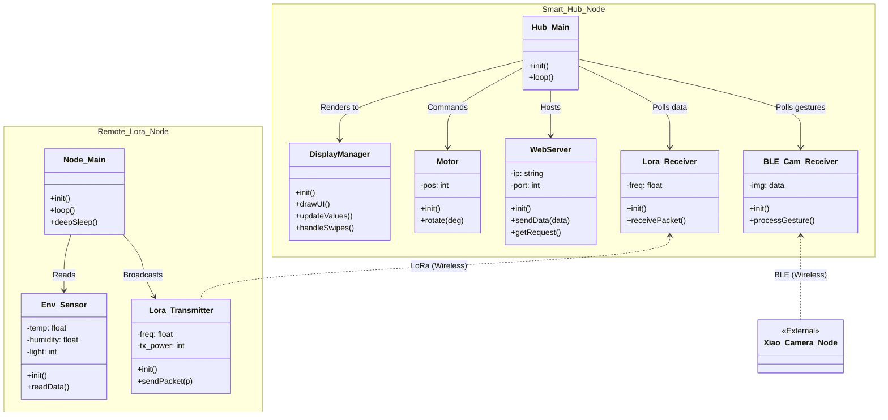

# IoT Connected SmartHub Dashboard: Architecture Diagram

Below is the proposed software architecture for the ECE436 Final Project: IoT Connected SmartHub Dashboard.

It outlines the separation of concerns utilizing a Hub-and-Spoke pattern on both the central Smart Hub (which manages the UI, gestures, web server, and servos) and the remote LoRa node (which operates in a low-power mode to read environmental data).

