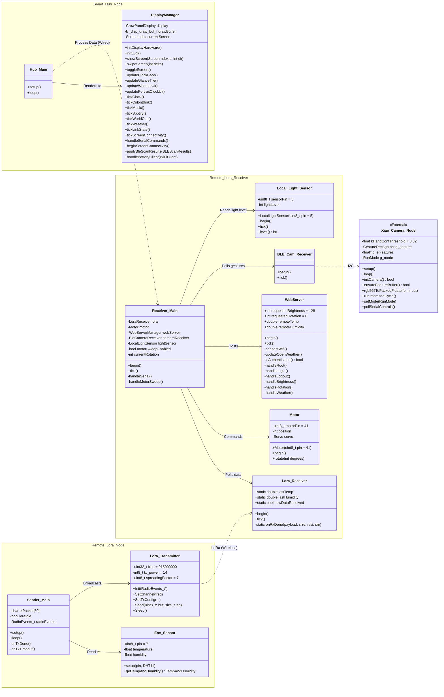

# IoT-SmartHub — System Architecture

The SmartHub is split across four nodes that talk over LoRa (915 MHz),
Wi-Fi/HTTP and UART:

| Node                 | Code path                          | Hardware                |
| -------------------- | ---------------------------------- | ----------------------- |
| Smart Hub (display)  | `Screen Code/Screen-pIO`           | CrowPanel ESP32-S3 7"   |
| Remote LoRa receiver | `Main Code/Main-pIO` (`src/receiver`) | ESP32-S3 DevKitC     |
| Remote LoRa sender   | `Main Code/Main-pIO` (`src/transmitter`) | Heltec WiFi-LoRa 32 V3 |
| Camera (external)    | `Camera Code/Camera-pIO`           | XIAO ESP32-S3 Sense     |

## Notes on the mapping

- **Hub_Main** is the `setup()` / `loop()` in
  [Screen Code/Screen-pIO/src/main.cpp](Screen%20Code/Screen-pIO/src/main.cpp).
- **DisplayManager** is a logical grouping of the LVGL-side free functions
  declared in the same `main.cpp` plus the feature `.inc` files under
  [Screen Code/Screen-pIO/src/features/](Screen%20Code/Screen-pIO/src/features/)
  (`clock_screen`, `weather_screen`, `music_player`, `world_cup_screen`,
  `screen_connectivity`, etc.). Swipes/gestures route through
  `swipeScreen(delta)` and `handleSerialCommands()`.
- **Sender_Main / Env_Sensor / Lora_Transmitter** correspond to the single
  translation unit
  [Main Code/Main-pIO/src/transmitter/main.cpp](Main%20Code/Main-pIO/src/transmitter/main.cpp).
  The `DHTesp dht` instance and the Heltec `Radio` driver are shown as
  separate classes to mirror the UML.
- **Receiver_Main** and the receiver-side classes live under
  [Main Code/Main-pIO/src/receiver/](Main%20Code/Main-pIO/src/receiver/) with
  matching headers in
  [Main Code/Main-pIO/include/receiver/](Main%20Code/Main-pIO/include/receiver/).
  `WebServer` in the diagram is implemented as `WebServerManager` in
  [WebServerManager.h](Main%20Code/Main-pIO/include/web/WebServerManager.h).
- **BLE_Cam_Receiver** is currently a placeholder
  ([BleCameraReceiver.cpp](Main%20Code/Main-pIO/src/receiver/BleCameraReceiver.cpp));
  gesture output from the XIAO camera is emitted as `[GESTURE] X` lines on
  the camera's UART by `runInferenceCycle()` in
  [Camera Code/Camera-pIO/src/main.cpp](Camera%20Code/Camera-pIO/src/main.cpp).
